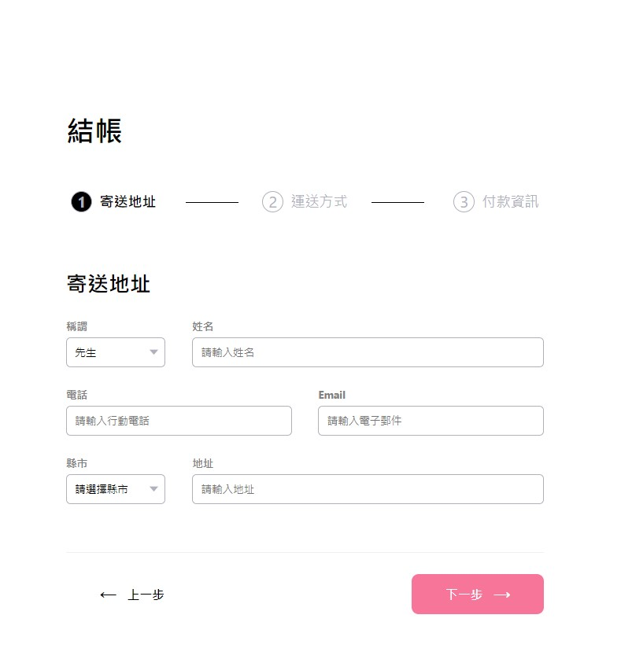

# Alpha Shop - React

## 開發工具
Node.js 14.18.1 \
React.js
module.css

## 使用說明
1. 在終端機將本專案 clone 到本機電腦 
`git clone https://github.com/KirkCMH/ac_shop.git`
2. 確認本機已安裝 node.js 與 npm `npm install`
3. 執行本專案 `npm start`
4. 在瀏覽器輸入 `http://localhost:3000` 瀏覽本專案

### ALPHA Shop I - 實作結帳區 (三個步驟的表單)

